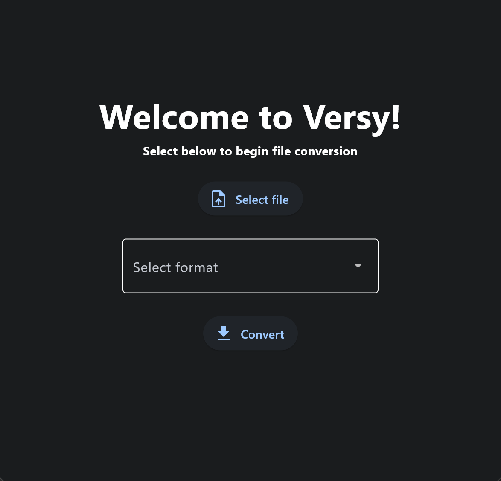

# Versy - The Converter App :file_folder:

Simple cross platform conversion app that uses Flet for GUI and Python

## Requirements
Packages needed to run Versy
- Flet
- OS
- Pydub
- Pillow (PIL)
- ffmpeg

## Supported OSes
- Windows
- MacOS*
- Linux*

* MacOS and Linux may require running file with root privileges as the program searches the file system for the file uploaded

## How To Run
Run main.py and follow the onscreen instructions

## Release Log
**Version 0.1.0**

Initial Release Support for the following file formats:

*Audio*
- MP3
- WAV
- OGG
- FLAC

*Video*
- MP4 
- AVI
- MOV
- WMV
- FLV
- WEBM

*Image* 
- PNG
- JPG
- JPEG
- BMP
- GIF
- TIFF

## TODO
- [ ] Multiple file conversion
- [ ] Improved error handling
- [ ] Support for more file types